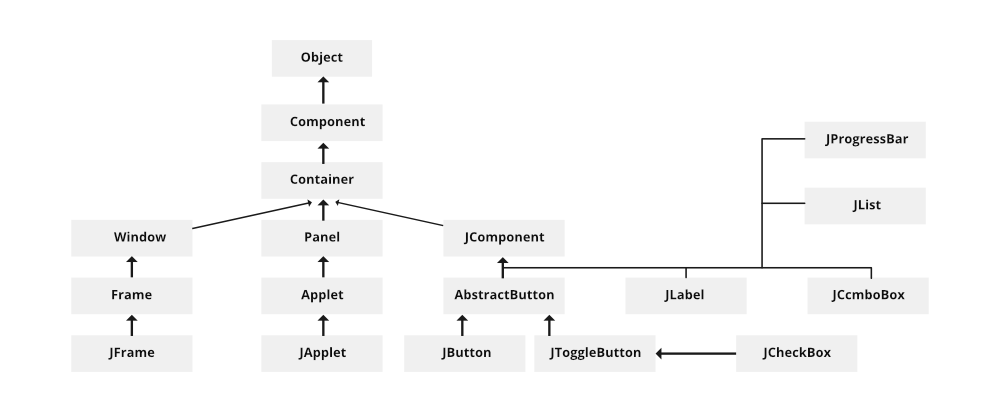

# Introduction to AWT and Swing

## 1. Concept

### AWT (Abstract Window Toolkit)
AWT is Java's original platform-dependent windowing, graphics, and user-interface widget toolkit. It provides the foundation for building graphical user interfaces (GUIs) in Java.

- It is part of the Java Foundation Classes (JFC).
- AWT components are "heavyweight" because they rely on the underlying operating system's windowing components.

### Swing

Swing is a GUI widget toolkit for Java, developed as a part of the Java Foundation Classes (JFC). It is built on top of AWT and provides a richer set of GUI components.

- Swing components are "lightweight" as they are written entirely in Java and do not rely on native GUI components.
- It provides a more flexible and customizable interface than AWT.

## 2. Applets

Applets are small Java programs that can be embedded in a webpage and run in the context of a browser.

- They extend the `java.applet.Applet` class (AWT-based) or `javax.swing.JApplet` class (Swing-based).
- Applets are now considered outdated and are not commonly used in modern Java applications due to security and compatibility issues.

## 3. Swing Class Hierarchy

### 🔺 Top Level: `Object`

- The root of all Java classes.
- Every class in Java implicitly extends `Object`.

### 🔹 `Component`

- The superclass for all AWT (Abstract Window Toolkit) components.
- It provides basic GUI features like size, location, and visibility.

### 🔹 `Container` (extends `Component`)

- A `Component` that can contain other components.
- Key for building UI layouts.

### 🔹 From `Container` it splits into three branches:
#### 📦 1. **Window → Frame → JFrame**
- `Window`: A top-level window with no borders or menu.
- `Frame`: A decorated window (with title, buttons, etc.).
- `JFrame`: A Swing version of `Frame`, commonly used for main application windows.

#### 📦 2. **Panel → Applet → JApplet**

- `Panel`: A generic container for organizing components.
- `Applet`: A container for Java applets (browser-embedded mini-apps).
- `JApplet`: Swing-based version of `Applet` with richer features.

#### 📦 3. **JComponent** (Core of Swing Components)

- All lightweight Swing components extend `JComponent`.
- Provides support for pluggable look-and-feel, double buffering, etc.

### ▶️ Under `JComponent`, it branches into:

#### ➤ `AbstractButton` → `JButton`, `JToggleButton` → `JCheckBox`

- `AbstractButton`: Base class for buttons.
- `JButton`: A push button.
- `JToggleButton`: A button that maintains its state (on/off).
- `JCheckBox`: A checkbox (a special kind of toggle button).

#### ➤ `JLabel`

- A component that displays a short string or an image icon.

#### ➤ `JComboBox`

- A drop-down list for selecting one item.

#### ➤ `JList`

- Displays a list of items for selection.

#### ➤ `JProgressBar`

- Displays progress visually for a task.

---

| Java AWT                                           | Java Swing                                                                            |
|----------------------------------------------------|---------------------------------------------------------------------------------------|
| ` It is an api to develop GUI application in Java. | It is the part of java  Foundation Classes and is used to create various application. |
|   Components of AWT are heavy weighted.            |  The components of Java Swing are lightweight.                                      |
|   Components are platform dependent.              |       Components are platform independent.                                            |
|   Execution Time is more than Swing.             |          Execution Time is less than AWT.                    |
|   AWT components require java.awt package.              |       Swing components requires javax.swing package.                          |
