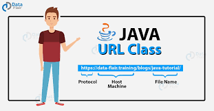

# Java Networking

Java Networking enables communication between computers over a network using the Java platform. It is part of the `java.net` package, which provides classes for both low-level and high-level network communication.

---

## 📡 Key Concepts

### 1. **IP Address**
- A unique address that identifies a device on the internet or local network.
- Types: IPv4 (32-bit), IPv6 (128-bit), public, private
- port: point of communication

### 2. **Port Number**
- Logical address used to identify specific processes/services on a device.
- Ranges from 0 to 65535.

### 3. **Socket**
- Endpoint for communication between two machines.
- Used in both TCP and UDP protocols.

---

## 🔌 Important Classes in `java.net`

| Class             | Description                                                   |
|-------------------|---------------------------------------------------------------|
| `InetAddress`     | Represents an IP address.                                     |
| `Socket`          | Implements a client socket (TCP).                             |
| `ServerSocket`    | Waits for requests from clients and establishes a connection. |
| `DatagramSocket`  | Enables sending and receiving UDP packets.                    |
| `DatagramPacket`  | Represents a UDP packet of data.                              |
| `URL`             | Represents a Uniform Resource Locator.                        |
| `URLConnection`   | Communicates with the resource referenced by a URL.           |

---

## 🔄 TCP vs UDP

| TCP                                | UDP                             |
|-------------------------------------|----------------------------------|
| Connection-oriented                 | Connectionless                   |
| Reliable (acknowledgment-based)     | Unreliable                       |
| Slower                              | Faster                           |
| Web, Email, File Transfer           | Streaming, Gaming, VoIP          |
| Acknoledgement                      | NoAcknowdlege                    |
| HandShaking                         | NoHandshaking                    |

---

## 💻 TCP Example (Client & Server)

### TCP Server
```java
import java.io.*;
import java.net.*;

public class TCPServer {
    public static void main(String[] args) throws IOException {
        ServerSocket server = new ServerSocket(5000);
        Socket socket = server.accept();
        DataInputStream input = new DataInputStream(socket.getInputStream());
        System.out.println("Client says: " + input.readUTF());
        input.close();
        socket.close();
        server.close();
    }
}
```
## UDP
- DatagramSockett--> for communication
- DatagramPacket --> To tarnsfer data

## Example program for creating a server

```java
package JavaNetworking;
import java.io.IOException;
import java.net.*;
public class UdpServer {
    public static void main(String[] args) throws IOException {
        DatagramSocket socket = new DatagramSocket(9099);
        byte[] data = new byte[1024];
        DatagramPacket packet = new DatagramPacket(data, data.length);
        socket.receive(packet);
        String msg = new String(packet.getData(), 0, packet.getLength());
        System.out.println("message :"+msg);
        String tomsg ="Hello from Server";
        byte[] todata = tomsg.getBytes();
        DatagramPacket topack = new DatagramPacket(todata, todata.length, packet.getAddress(), packet.getPort());
        socket.send(topack);
        socket.close();
    }
}
```

## Example program for creating client 

```java
package JavaNetworking;
import java.io.IOException;
import java.net.*;

public class UdpClient {
    public static void main(String [] args) throws IOException {
        DatagramSocket socket=new DatagramSocket();
        String msg ="Hello from client";
        byte[]  bmsg = msg.getBytes();
        InetAddress address = InetAddress.getByName("localhost");
        DatagramPacket packet = new DatagramPacket(bmsg, bmsg.length, address, 9099);
        socket.send(packet);
        byte[] smsg = new byte[1024];
        DatagramPacket spacket = new DatagramPacket(smsg, smsg.length);
        socket.receive(spacket);
        String  smessage = new String(spacket.getData(), 0, spacket.getLength());
        System.out.println("Server message:" + smessage);
        socket.close();


    }
}
```
---
## 🔸 Server Socket (java.net.ServerSocket)

```java
ServerSocket server = new ServerSocket(int port);
Socket socket = server.accept();
```

### ✅ Key Points:
- `ServerSocket` is used on the **server-side** to listen for incoming connections.
- `port` is a number from 0 to 65535 that identifies the process or service.
- `accept()` waits for a client connection and returns a `Socket` object for communication.

### 🧠 Useful Methods:
| Method                | Description                                  |
|-----------------------|----------------------------------------------|
| `accept()`            | Waits for a client and returns a `Socket`    |
| `close()`             | Closes the server socket                     |
| `getInetAddress()`    | Returns the server’s IP address              |
| `getLocalPort()`      | Returns the port the server is listening on  |

---

## 🔹 Client Socket (java.net.Socket)

```java
Socket client = new Socket(String host, int port);
```

### ✅ Key Points:
- `Socket` is used on the **client-side** to initiate a connection to the server.
- `host` is the IP address or hostname of the server.
- `port` is the same port the server is listening on.

### 🧠 Useful Methods:
| Method                | Description                                    |
|-----------------------|------------------------------------------------|
| `getInputStream()`    | Reads data from the server                     |
| `getOutputStream()`   | Sends data to the server                       |
| `close()`             | Closes the socket connection                   |
| `getInetAddress()`    | Returns the server’s IP address                |
| `getPort()`           | Returns the server’s port number               |

---

## 🔄 Server-Client Communication Flow

### 🖥️ Server Code Example
```java
ServerSocket server = new ServerSocket(5000);
Socket socket = server.accept();
InputStream in = socket.getInputStream();
OutputStream out = socket.getOutputStream();
```

###  Client Code Example
```java
Socket client = new Socket("127.0.0.1", 5000);
InputStream in = client.getInputStream();
OutputStream out = client.getOutputStream();
```

---

###  Tips for Better Communication

- Always handle `IOException` using try-catch blocks.
- Use `BufferedReader` and `PrintWriter` for easier communication:
  ```java
  BufferedReader reader = new BufferedReader(new InputStreamReader(socket.getInputStream()));
  PrintWriter writer = new PrintWriter(socket.getOutputStream(), true);
  ```
- Always close sockets and streams using try-with-resources or in a `finally` block.

---
## RMI (Remote Method Invocation)
- It is an API that allows an object to invoke a method on an object that exists in another address space, which could be on the same machine or on a remote machine.
- Used to call the method from one computer to another.
   
   
     ***Fig:Working of RMI***
### Steps
- Create a new method interface by inheriting from remote. Method should throw RemoteException
```java
import java.rmi.*;
public interface MyRemote extends Remote{
    public int add(int a, int b)throws RemoteException;
}
```
- Create implementor class which should inherit from UnicastRemoteObject implements the remote method

```java
import java.rmi.*;
import java.rmi.server.UnicastRemoteObject;

public class MyRemoteImpl extends UnicastRemoteObject implements MyRemote{
    public MyRemoteImpl() throws RemoteException
    {
        super();
    }
    public int add(int a, int b) throws RemoteException{
        return a+b;
    }
}
```
- Create a server class, Bind the object

```java
import java.rmi.*;
import java.rmi.registry.LocateRegistry;

public class MyRemoteServer {
  public static void main(String[] args) throws Exception {
    MyRemoteImpl obj = new MyRemoteImpl();
    LocateRegistry.createRegistry(1099);
    System.out.println("RMI Registry Started");
    Naming.rebind("MyOBJ", obj);
  }
}
```
- Create a client class. which should call the remote method. 

```java
import java.rmi.*;
public class RMIClient {
    public static void main(String[] args)throws Exception{
        MyRemot obj = (MyRemote) Naming.lookup("rmi://locakhost/MYOBJ");
        System.out.println("Reasult from remote call:" +obj.add(10,10));
    }
}
```
---
**To Bind object in  RMI Registry**
- Locate registry, create registry(1099)
- Naming.rebind("myobj", obj) myobj-> unique id .... obj-> object

**To invoke the method from client**
- Naming.Lookup("rmi://localhost/obj")
---

## URL (Uniform Resource Locator)

- A URL is a Uniform Resource Locator, used to identify and locate a resource on the World Wide Web.
  It provides the address of a web resource and is essential in Java for handling web-based content.



```java
URL u = new URL("https://www.facebook.com");
```
- getProtocol()
  - Returns the protocol used (e.g., http, https)
- getHost()
  - Returns the host name (e.g., www.facebook.com)
- getPort()
  - Returns the port number (returns -1 if not set)
- getPath()
  - Returns the file path of the URL
- getQuery()
  - Returns the query part of the URL- OpenConnection()

**🔗 Opening Connection to the Web**
- Java uses the URLConnection class to connect to and interact with a web resource.

```java
URLConnection connection = url.openConnection();
InputStream input = connection.getInputStream();
```
🔄 Key Method:
- getInputStream(): Used to read data from the web page or server.

**Example**

```java
import java.io.BufferedReader;
import java.io.InputStreamReader;
import java.net.*;

class URLConnectionDemo {
    public static void main(String[] args) throws Exception {
        URL u = new URL("http://www.ghimire-bibek.com.np");
        URLConnection con = u.openConnection();
        BufferedReader br = new BufferedReader(new InputStreamReader(con.getInputStream()));
        while(true){
            String line = br.readLine();
            if(null==line){
                break;
            }
            System.out.println(line);
        }
    }
}
```
---
## Java mail API
- To send or receive email