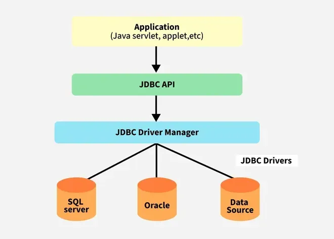

# Java Database Connectivity
JDBC is an API that helps applications to communicate with databases, it allows Java programs to connect to a database, run queries, retrieve, and manipulate data.

## JDBC Architecture



---

## Types of Drivers
- Type1 (JDBC-ODBC-BRIDGE) - with the help of odbc(open database connectivity)
- Type2 (VENDOR SPECIFIC-OCI)- vendor provided
- Type3 (Network Driver)- Through Network
- Type4 (Pure Java Driver)-Written in java

## Interfaces and Classes of JDBC API
Following is the list of mostly used interfaces and classes in JDBC API.
- DriverManager class − used to load a SQL driver to connect to database.
- Connection interface − used to make a connection to the database using database connection string and credentials.
- Statement interface − used to make a query to the database.
- PreparedStatement interface − used for a query with placeholder values.
- CallableStatement interface − used to called stored procedure or functions in database.
- ResultSet interface − represents the query results obtained from the database.
- ResultSetMetaData interface − represents the metadata of the result set.
- BLOB class − represents binary data stored in BLOB format in database table.
- CLOB class − represents text data like XML stored in database table

## Steps of JDBC:
### Import the required package
```java
import java.sql.*;// Required for all JDBC classes
``` 

### Load the JDBC Driver 
```java
Class.forName("com.mysql.cj.jdbc.Driver");
// This loads the MySQL JDBC driver into memory

```
### Establish the  Connection
```java
Connection con = DriverManager.getConnection(
    "jdbc:mysql://localhost:3306/studentdb", "root", "password");
// Replace DB name, username, and password as per your setup

```
### Prepare the Query
```java
Statement stmt = con.createStatement();
String query = "SELECT * FROM students";

```
or
```java
PreparedStatement pstmt = con.prepareStatement("SELECT * FROM students WHERE id = ?");
pstmt.setInt(1, 1); // Setting parameter value

```
### Execute the Query
**For Select**
```java
ResultSet rs = stmt.executeQuery(query); // for Statement

// or
ResultSet rs = pstmt.executeQuery(); // for PreparedStatement

```
**For INSERT/UPDATE/DELETE:**
```java
int rowsAffected = stmt.executeUpdate("INSERT INTO students VALUES (1, 'Bibek')");

```
### Process the Result
```java
while (rs.next()) {
    int id = rs.getInt("id");
    String name = rs.getString("name");
    System.out.println("ID: " + id + ", Name: " + name);
}

```
### Close the connection
```java
rs.close();       // Close ResultSet
stmt.close();     // or pstmt.close();
con.close();      // Close Connection

```
### Example program of JDBC
```java
package Ch5JDBC;

import java.sql.*;

public class JdbcDemo {
    public static void main(String[] args) throws Exception {
        // Step 1: Load the JDBC Driver
        Class.forName("com.mysql.cj.jdbc.Driver");

        // Step 2: Establish the Connection
        Connection con = DriverManager.getConnection(
                "jdbc:mysql://localhost:3306/db", "root", "your_password"); // Replace 'db' with your DB name and 'your_password'

        // Step 3: Prepare the Query (Use ? placeholders)
        String q = "INSERT INTO user (id, name, email, password) VALUES (?, ?, ?, ?)";

        // Step 4: Create the PreparedStatement object
        PreparedStatement pre = con.prepareStatement(q);

        // Step 5: Set the values for placeholders
        pre.setString(1, "101");
        pre.setString(2, "ABC");
        pre.setString(3, "abc@gmail.com");
        pre.setString(4, "ABC");

        // Step 6: Execute the query
        pre.executeUpdate();

        // Step 7: Close resources
        pre.close();
        con.close();

        System.out.println("Data Added Successfully");
    }
}

```