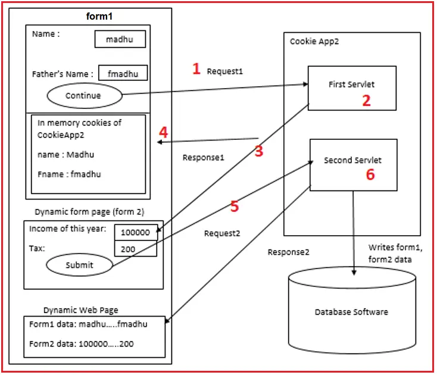

# 📘 Unit 6: Servlets and JSP (6 Hours)

---

## Overview of Web Application

A **Web Application** is a client-server application that runs in a browser and communicates over HTTP/HTTPS.

### Key Components:

* **Client**: Browser (Chrome, Firefox, etc.)
* **Web Server**: Apache Tomcat (handles requests)
* **Backend**: Servlet/JSP/Java code
* **Database**: MySQL, Oracle, etc.

### Web App Flow:

1. User sends request from browser
2. Server receives request (HTTP)
3. Servlet processes logic and interacts with DB
4. Response is sent back to client

---

## HTTP Methods and Responses

### 🔁 HTTP Methods:

| Method | Purpose       |
| ------ | ------------- |
| GET    | Retrieve data |
| POST   | Submit data   |
| PUT    | Update data   |
| DELETE | Delete data   |

### 📨 HTTP Responses:

* Status Codes:

    * `200 OK`: Successful
    * `404 Not Found`: Resource not found
    * `500 Internal Server Error`: Server crash
    * `302 Found`: Redirect

---

## Servlets
- A **Servlet** is a Java class that handles HTTP requests and generates responses.
- Java program to Accept Request process and generate the response.

### To create servlets
- Inherit from HttpServlet.
- Use doGet/doPost Methods
- Define URL using @webservlets("/Demo)- Annotation

**Example**

```java
import com.sun.net.httpserver.HttpServer;
import jakarta.servlet.https.*;

@webservlets("/demo");
public class MyServlets extends HttpServlet{
    public static void main(String [] args){
        printwriter.out = res.getwriter();
        out.println("Hello");
    }
}
```

### 🚦 Servlet Life Cycle:

1. **Loading**: Servlet class is loaded.
2. **Instantiation**: Object of servlet is created.
3. **Initialization**: `init()` method called once.
4. **Request Handling**: `service()` → `doGet()` / `doPost()` called multiple times.
5. **Destroying**: `destroy()` called before servlet is unloaded.

### 🔁 Servlet Methods:

```java
public void init() throws ServletException { }
public void service(ServletRequest req, ServletResponse res) { }
public void destroy() { }
```

---

**Example**

```java
import com.sun.net.httpserver.HttpServer;
import jakarta.servlet.*;

@WebServlet("/lifecycle")
public class LifeCycleServlets extends HttpServlet {
  public void init(ServletConfig config) throws Exception {
    System.out.println("Servlet Initialized");
  }

  public void Service(HttpServetRequest req, HttpServletResponse res)throws Exception{
      System.out.println("Service called...");
      
  }
  public void destroy(){
    System.out.println("Destroyed called...");
  }
}
```
## 6.4 Writing Servlet Programs with Servlet APIs

### ✅ Steps to Write a Servlet:

1. Extend `HttpServlet`
2. Override `doGet()` or `doPost()`
3. Map the servlet in `web.xml` or use `@WebServlet` annotation


### 🔹 **HttpServletRequest Methods**

* `getParameter(String)` → Retrieves single parameter value
* `getParameterValues(String)` → Returns array (for multiple values like checkboxes)
* `getSession()` → Gets the current session
* `getCookies()` → Gets the cookies

---

### 🔹 **Form Input Types**

* Text Input
* Radio Button
* Select (Dropdown)
* Checkbox
* Button

```html
<input type="text" name="name" />
```

---

### 🔹 **Example Flow**

1. HTML Form Input

   ```html
   Name: [ABC]
   Email: [abc@example.com]
   [OK]
   ```
2. Sent to Servlet

   ```
   Servlet Output:
   Hello ABC
   abc@example.com
   ```

---

### 📁 **Folder Structure**

```
webapps/
├── html/
├── css/
├── js/
├── image/
└── WEB-INF/
    ├── classes/ (Java .class files)
    └── lib/     (.jar libraries)
```

---

## 📄 **HTML Form**

```html
<html>
  <body>
    <form method="post" action="FormServlet">
      Name: <input type="text" name="name" /><br />
      Email: <input type="text" name="email" /><br />
      <input type="submit" value="Submit" />
    </form>
  </body>
</html>
```

---

## 🔧 **FormServlet.java**

```java
import jakarta.servlet.http.*;
import jakarta.servlet.annotation.*;

@WebServlet("/FormServlet")
public class FormServlet extends HttpServlet {
    
    public void doPost(HttpServletRequest req, HttpServletResponse res) throws IOException {
        String name = req.getParameter("name");
        String email = req.getParameter("email");

        PrintWriter out = res.getWriter();
        out.println("Name: " + name);
        out.println("Email: " + email);
        out.close();
    }
}
```

---
remaining
---

## 🍪 Cookies in JSP


* A **cookie** is a small piece of data stored on the **client's browser**.
* It is mainly used to **track user activity** and **store user information** like name, login status, preferences, etc.


### 🧱 Basic Cookie Methods in Java

```java
Cookie cookie = new Cookie(String name, String value); // Create cookie
cookie.getValue();      // Get the value of the cookie
cookie.getName();       // Get the name of the cookie
cookie.setMaxAge(int seconds); // Set the cookie expiration time
```

### ➕ Adding a Cookie to Response

```java
response.addCookie(cookie); // Send cookie to the client
```

### 📝 HTML Form (to take user input)

```html
<html>
<body>
    <form method="get" action="setcookie.jsp">
        Name: <input type="text" name="name"><br>
        <input type="submit" value="Submit">
    </form>
</body>
</html>
```


### 🍪 JSP to Set Cookie (`setcookie.jsp`)

```jsp
<%
String name = request.getParameter("name");
Cookie cookie = new Cookie("NAME", name);
cookie.setMaxAge(60 * 60); // 1 hour (optional)
response.addCookie(cookie);
out.println("✅ Cookie Added Successfully");
%>
```


### 🍪 JSP to Read Cookie (`getcookie.jsp`)

```jsp
<%
Cookie[] cookies = request.getCookies();

if (cookies != null) {
    for (Cookie c : cookies) {
        if (c.getName().equals("NAME")) {
            String value = c.getValue();
            out.println("👋 Welcome, " + value);
            break;
        }
    }
} else {
    out.println("❌ No cookies found");
}
%>
```


### 🖼️ Cookie Flow Diagram (Example)




### 💡 Notes

* Cookies are stored on the **client side**, so don't store sensitive data.
* You can set `setMaxAge(0)` to delete the cookie.
* If not set, the cookie is removed when the browser closes (session cookie).

---
