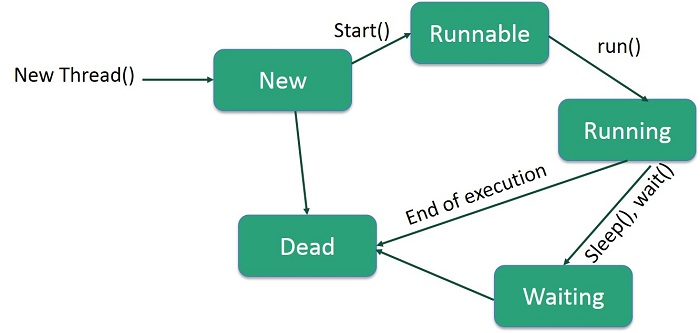

# Advanced Java Topic

## ORM (Object Relation Mapping)
- To map Java object with database table
- Database Table to java object

## ORM Framework
- Hibernate
- JPA
- Spring Data
- MyBatis

### Hibernate
- Hibernate is an ORM framework that provides a way to map Java objects to database tables.
- It simplifies database interactions by allowing developers to work with Java objects instead of SQL queries.
- Hibernate supports various database operations such as CRUD (Create, Read, Update, Delete) and provides features like caching, lazy loading, and transaction management.
- It is widely used in Java applications to handle database operations efficiently and effectively.
- Hibernate provides a powerful query language called HQL (Hibernate Query Language) that allows developers to write database queries using Java-like syntax.
 
1. Create a Maven project in your IDE.
2. Add Hibernate dependencies to your `pom.xml` file:
```xml
<dependency>
    <dependency>
        <groupId>org.hibernate</groupId>
        <artifactId>hibernate-core</artifactId>
        <version>5.4.32.Final</version>
    </dependency>
-- jakarta.persistence
-- mysql-connector-java
```
3. Create a Hibernate configuration file (`hibernate.cfg.xml`) in the `src/main/resources` directory:
```xml
<hibernate-configuration>
    <session-factory>
        <property name="hibernate.dialect">org.hibernate.dialect.MySQLDialect</property>
        <property name="hibernate.connection.driver_class">com.mysql.cj.jdbc.Driver</property>
        <property name="hibernate.connection.url">jdbc:mysql://localhost:3306/your_database</property>
        <property name="hibernate.connection.username">your_username</property>
        <property name="hibernate.connection.password">your_password</property>
        <mapping class="com.example.YourEntityClass"/>
    </session-factory>

</hibernate-configuration>
``` 
4. Create a table in your MySQL database
5. Create an entity class that represents the table.
6. Create main class to work with ORM.

#### Entity Class
```java
@entity
class employee {
   @Id
    @GeneratedValue(strategy = GenerationType.IDENTITY)
    @column(name = "id")
    int id;
    @column(name = "emp-name")
    String Name;
    // getters and setters
    
}
```

**Example**

```java
import com.mysql.cj.xdevapi.SessionFactory;
import org.hibernate.*;
import org.hibernate.cfg.*;

import javax.security.auth.login.Configuration;

public class HibernateDemo {
    public static void main(String[] args) {
        SessionFactory factory = new Configuration.configure("hibernate.cfg.xml").buildSessionFactory();
        Session session = factory.openSession();
        session.beginTransaction();
        Employee e = new Employee();
        e.setName("Bibek");
        e.setSalary(50000);
        e.setPersist(e);
        session.getTransaction().commit();
        session.close();
        session = factory.openSession();
        Emp;loyee emp = session.get(Employee.class, 1);
        System.out.println("Employee Name: " + emp.getName());
        session.BeginTransaction();
        e1.setSalary(60000);
        session.Merge(e1);
        session.getTransaction().commit();
        session.close();
    }
}
```

## WebFramework

- A web framework is a software framework designed to aid the development of web applications including web services, web resources, and web APIs.

<u>Java Based web Framework</u>
- Spring Boot\MVC
- JSF (JavaServer Faces)
- Stmts
**Features**
- Security
- Templating
- MVC pattern
- REST
- ORM


## Threading

- Process
- Multithreading
 - To run process at a same time
 

#### To Create Thread
- By inheriting from thread
- By implementing Runnable interface

#### Life Cycle of Thread


```java
class ThreadDemo implements Runnable{
    Thread t;
    ThreadDemo(){
        t= new Thread(this);
        t.start();
    }
    public void run(){
        for( int i= 0; i<10;i++){
            System.out.println("Hello:"+i);
            try{
                t.sleep(1000);
                
            }catch (Exception e){}
        }
    }
    public static void main(String[] args){
        ThreadDemo obj = new ThreadDemo();
        ThreadDemo obj1 = new ThreadDemo();
        
    }
}
```